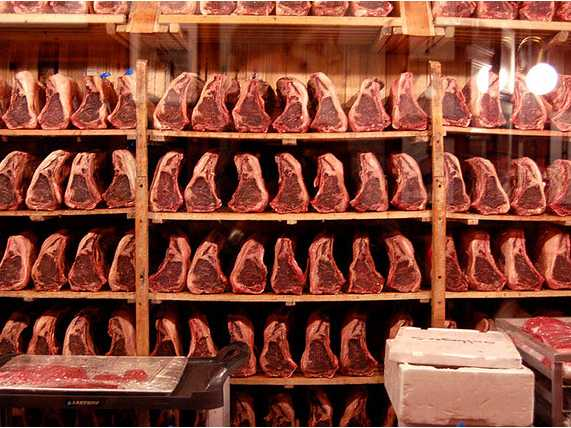
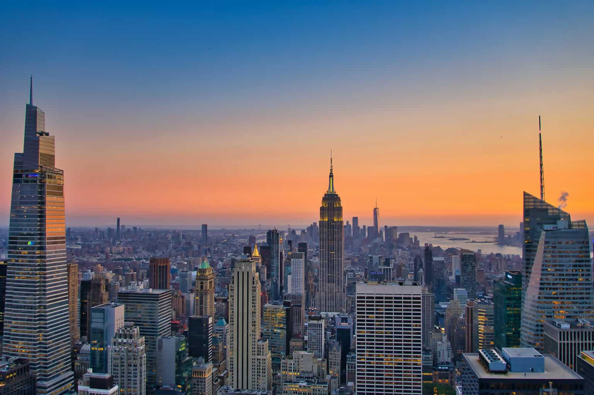
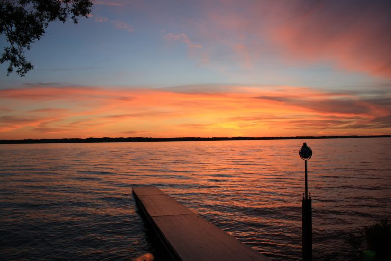
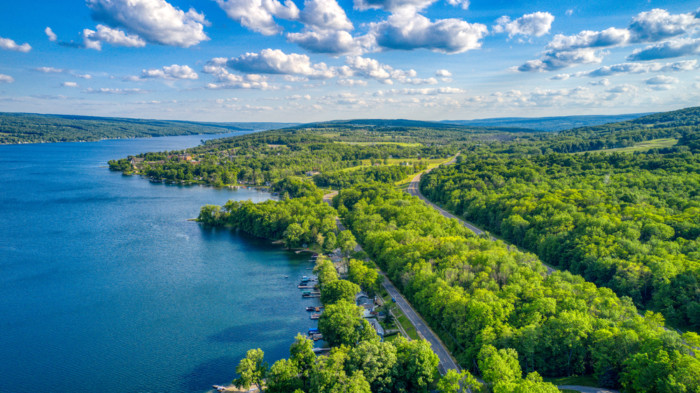
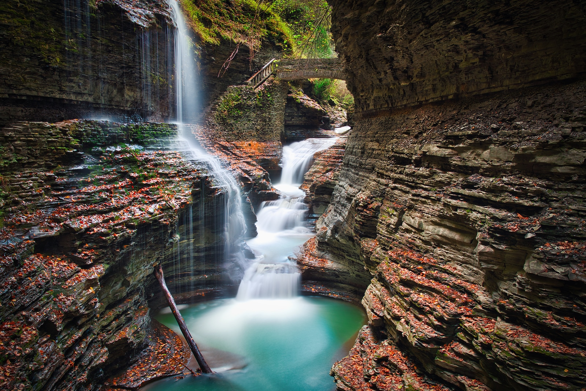
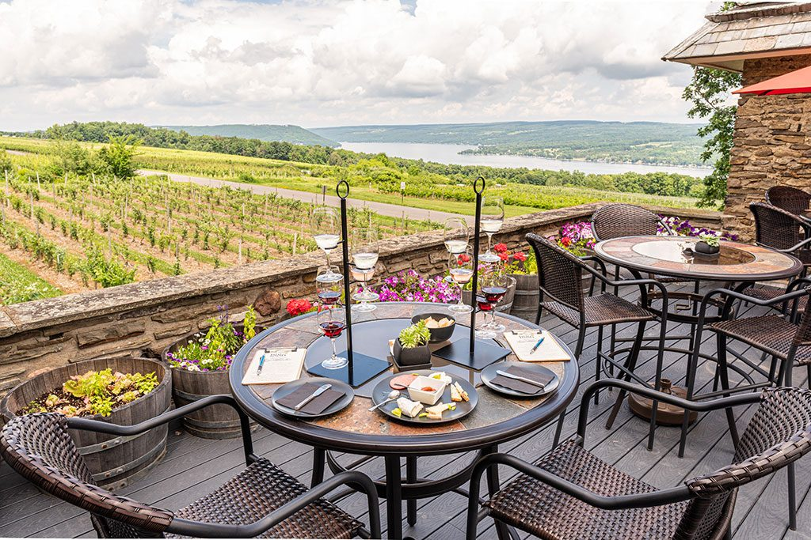
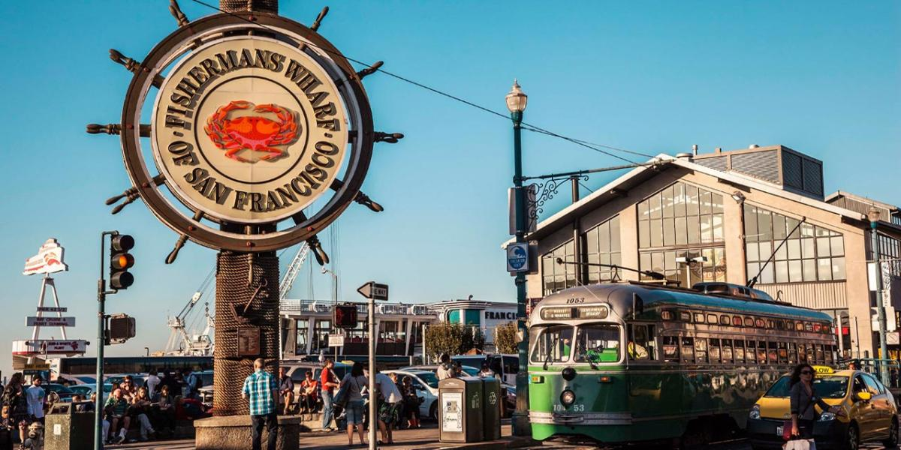
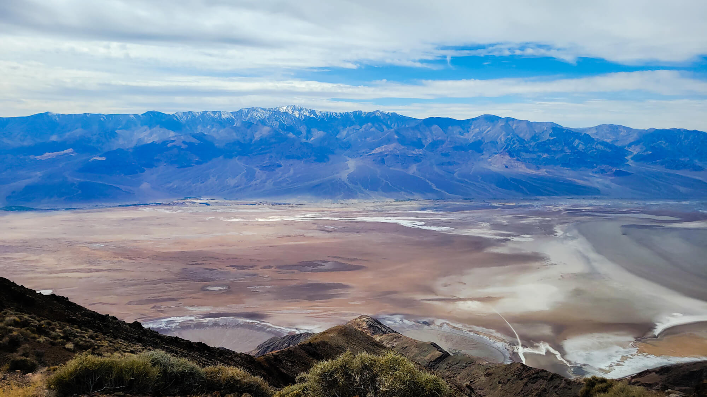
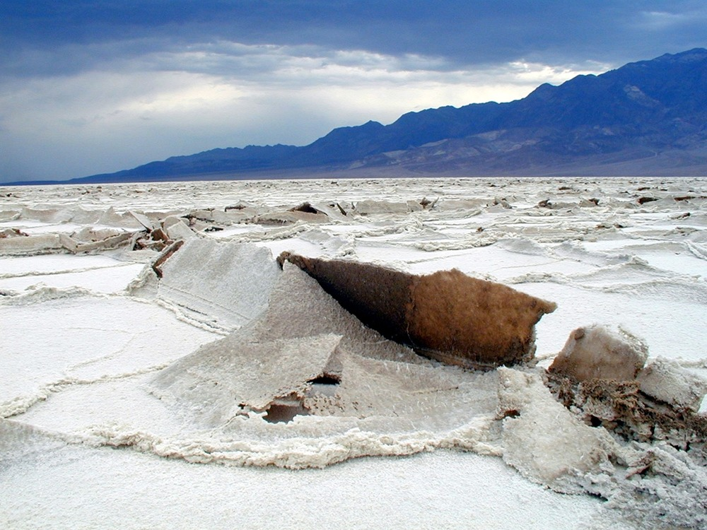

# 行程安排

## 21号
1. 提车后入住酒店休息

2. 在Hoboken用晚餐并欣赏哈德逊河夜景

3. 冠凯和格格回伊萨卡放行李后返回纽约

   
   *哈德逊河夜景，对面即是曼哈顿*

## 22号
1. 早上去唐人街吃早饭
2. 参观911纪念馆和华尔街（纽交所，铜牛等）
3. 简单补充能量
4. 坐游轮环曼哈顿岛观景（1:30PM，待预定）
   - 途径自由女神像，帝国大厦，布鲁克林桥等地标
   - 全程两个半小时
5. 四点下船
6. 前往纽约老字号牛排馆Gallaghers用餐（已预约）
7. 去洛克菲勒大厦观景曼哈顿日落（待预约，如果当天天气不好则前一天去）
8. 坐地铁去JFK机场取车，回酒店休息

*911纪念馆：两个水池是世贸中心A塔和B塔的旧址*

*华尔街：世界金融中心*

*自由女神像：纽约和美国的象征*

*帝国大厦：100年前建成的摩天大楼*

*Gallagher牛排馆内正在干式熟成的牛排*

*洛克菲勒中心俯瞰曼哈顿：画面中间为帝国大厦，左侧为范德堡中心，右侧为时代广场，远处为新世贸大厦*

## 23号
1. 酒店附近用餐
2. 参观联合国内部（9:45AM，已预约）
3. 在Keen's吃午饭（11:30，已预约）
4. 开车前往华盛顿哥伦比亚特区(DC)
   - 途径费城和巴尔的摩，车览
   - 下午5:30到达DC的酒店
5. 前往DC市区吃饭（待预约）

*联合国大会会场，参观中可以在玻璃外看到*

*费城市区*

## 24号
1. 前往DC市区步行游览
   - 华盛顿纪念碑-国会大厦之间的一条街
2. 参观国会大厦内部（10:30AM，已预约）
3. DC市区用午餐（待预约）
4. 登顶华盛顿纪念碑参观（下午3:00PM，待预约，前一天早上10点放票）
5. 外观白宫
6. 前往靶场体验射击
   - 真枪实弹，全世界只有美国可以体验，保护措施周密，绝对安全
7. 晚餐（待预约），回酒店休息

*华盛顿特区航拍：画面中间为国会大厦，其面对的白色尖塔为华盛顿纪念碑，其背后的诸多建筑包括美国最高法院，参议院大楼等。白宫位于此图的右上角。*

*经常被误认为是白宫的国会大厦*

*这才是真正的白宫：美国总统办公和生活的地点*

*实弹射击的靶场：每个位置之间都有防弹玻璃，且后面有保安*

## 25号
1. 酒店附近用早餐
2. 离开DC（约早上6:00）
3. 前往康奈尔大学
4. 参加康奈尔大学Convocation（中午12:00到13:30）
5. 校园参观，拍毕业照（准备好体力，可能需要走三四万步路）
6. 前往卡尤加湖岸边在日落时分乘帆船游览（1980年的Echo号，11米长，已预约，若当天天气不好则推迟到27或28号）
7. 前往雪城酒店休息

*康奈尔大学*

*康奈尔大学植物园*

*Echo号帆船*

*日落时分的卡尤加湖*

## 26号
1. 雪城酒店用早餐
2. 开车前往Corning
   - 途径五指湖地区，欣赏美丽的农场，谷仓等景色
3. 在Corning用午餐
4. 参观康宁玻璃博物馆
5. 开车前往伊萨卡参加计算机专业毕业典礼（5:00PM）
6. 伊萨卡用晚餐
7. 返回雪城

*五指湖地区的景色*

*康宁玻璃博物馆*

## 27号
1. 雪城吃早餐
2. 前往伊萨卡
3. 参加学校毕业典礼（中午12:30开始，下午3:30结束）
4. 伊萨卡附近参观拍照（taughannock falls，buttermilk state park，ithaca falls等）
5. *备选:* 若25号天气不好则帆船之旅移到27号，可在湖边烧烤

*Taughannock Falls：伊萨卡附近垂直落差最大的瀑布*

## 28号
1. 雪城吃早餐
2. 前往Watkins Glen
   - 沿途欣赏美丽的风景
3. 徒步Watkins Glen State Park
4. 参观塞尼卡湖岸边的康斯坦丁酒庄，了解葡萄酒酿制流程并品尝葡萄酒
5. 返回伊萨卡，在湖边烧烤
6. *备选:* 若25和27号天气均不好则帆船之旅移到28号

*Watkins Glen State Park：美国最美的公园之一*

*在葡萄庄园边的酒庄里品酒*

## 29号
1. 雪城酒店吃早餐
2. 开车前往纽约
3. 乘飞机去旧金山，入住旧金山机场附近酒店

## 30号

1. 坐酒店shuttle去机场取车

2. 开车前往旧金山市区

3. 在旧金山市区参观渔人码头，九曲花街等热门景点

4. 开车前往死亡谷国家公园，当晚到达沙漠边缘最后的城镇Bakersfield并落宿

   
   *九曲花街*

   
   *渔人码头*

## 31号

1. 酒店出发，向东进入死亡谷国家公园，中午左右正式抵达死亡谷国家公园核心区域，开车依次参观Dante's View, Badwater Basin, Mesquite Flat Sand Dunes等景点。

   死亡谷国家公园位于美国加利福尼亚州与内华达州交界处，是全美最大，同时也是最热、最干燥的国家公园。这里充满了独特的风景，如盐田、沙丘、断崖和色彩斑斓的岩石。公园中最著名的景点包括巴迪瀑布、魔鬼高尔夫球场和曲径通幽的艺术家谷。死亡谷也是星空观赏的绝佳之地，无污染的夜空展现出繁星点点。在这里，您将有机会体验到大自然的鬼斧神工和无尽的神秘。虽然公园的名字可能让人望而生畏，但其独特的美景和探索的乐趣却值得每一位勇敢的旅行者去发现。同时，由于其气候特点，死亡谷周围也是美国很多最高级别军事基地的所在基地，包括51区，臭鼬工厂，莫哈韦太空港等。

2. 日落后驱车前往拉斯维加斯，住拉斯维加斯

   

   *Dante's View*

   

   *Badwater Basin*

   
   *Mesquite Dunes*

   

## 1号

1. 拉斯维加斯酒店出发前往胡佛水坝，参观美国21世纪最伟大的工程之一：胡佛大坝，位于美国内华达州与亚利桑那州的交界处，是一座壮观的工程奇迹，也是人类智慧与毅力的象征。这座20世纪30年代建造的混凝土弧形大坝，高221米，长379米，是当时最大的混凝土结构和最复杂的水电项目。它的建造不仅成功地控制了科罗拉多河的水流，防止了洪水，提供了灌溉水源，还创造了大坝后面的美丽人工湖——米德湖，为周围地区提供了大量的水电能源。大坝的建设雇佣了数千名工人，对于当时的美国经济大萧条时期的就业市场来说，这是一个重要的刺激。

2. 拉斯维加斯和澳门并称世界第一大赌城，下午可以去市区内装修豪华的赌场参观游览，并享受美食，同时适当休整。

   
   *胡佛水坝*

   
   *拉斯维加斯市区夜景*

## 2号

1. 早上开车前往洛杉矶的朋友家，中午左右抵达。

## 3号

1. 晚上的飞机，飞回国内
